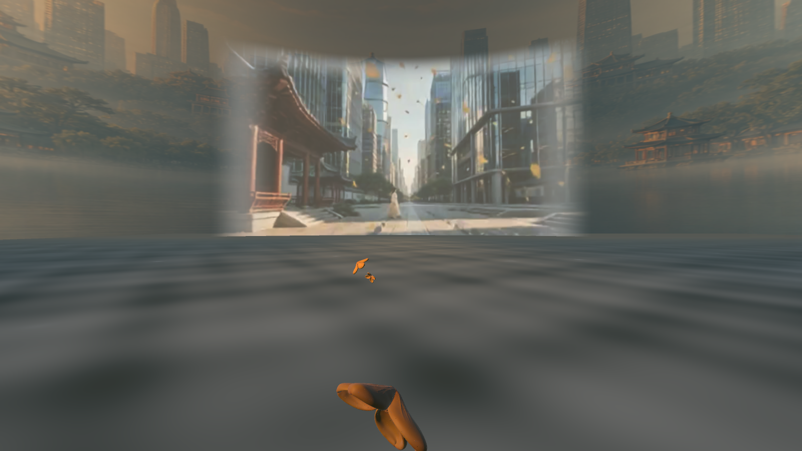
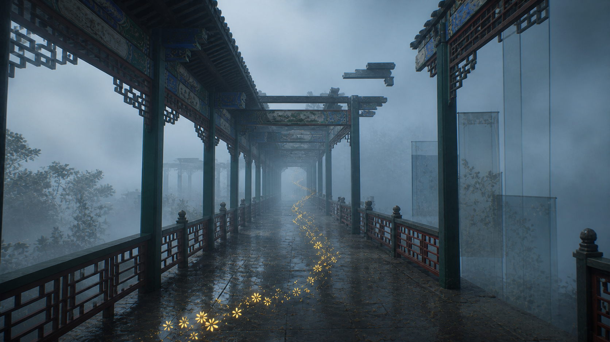
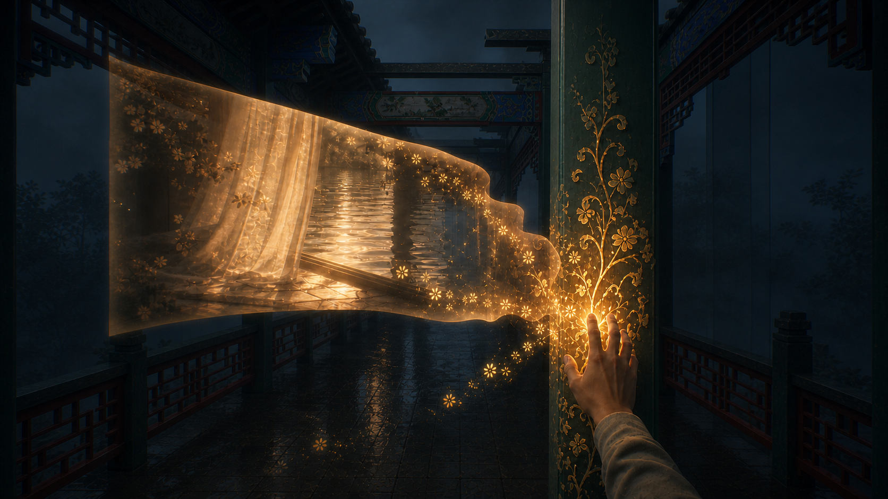
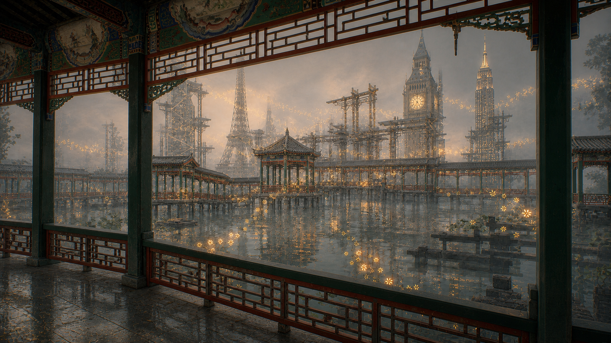
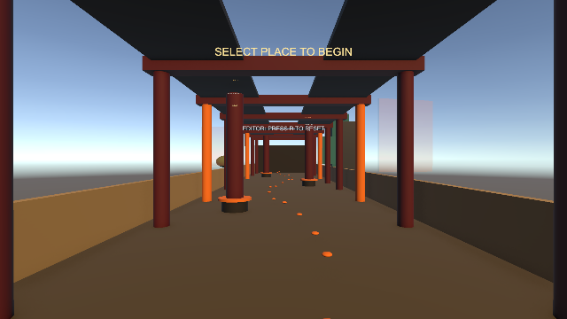
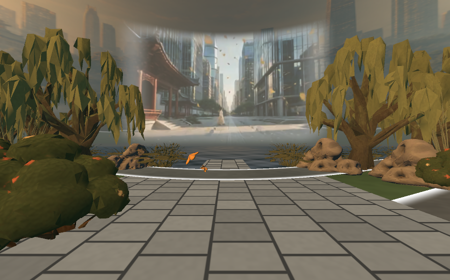
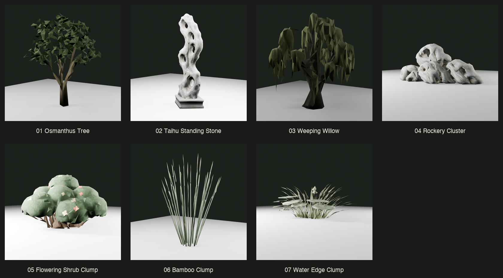
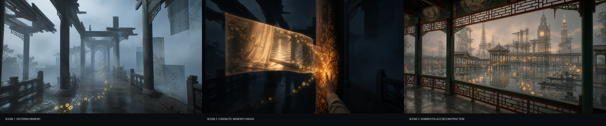

# Osmanthus VR

> A four-minute walk through a memory that is still changing.

A personal project made in fourteen days during a summer course at Aalto University · Meta Quest 3 · Unity 6 URP

[Demo APK](https://drive.google.com/file/d/1w0NJ-LmFVACYVS74QvLoZ5JhCP91i4tn/view?usp=share_link) · [Concept deck](_team%20reference/Concept%20demo.pdf) · Gameplay walkthrough coming soon



---

## The idea

There is a kind of remembering that happens before thought. You pass a tree on an autumn street, catch the smell of osmanthus, and for a moment you are somewhere else. You don't see the place clearly. What comes back is a season, a temperature, and the feeling of having once stood inside a world that made sense to you.

This project started with that moment, and with a question: **what are we actually returning to when a scent takes us back?**

I don't think it's a place, at least not the place as it was. Every city I have lived in, and every version of myself I have grown out of, has left something behind in the memory. The corridor I remember is real, but it is lit by later afternoons and crowded with buildings from cities I met afterward. I haven't lost the memory. It has kept living, and it has changed along with me.

Osmanthus VR tries to make that movement something you can walk through. A few golden flowers drift through a corridor inspired by the Long Corridor of Beijing's Summer Palace. The architecture is not rebuilt stone by stone. It appears the way memory does: clear in one bay, missing in the next. At the end of the corridor is a lake, and on the far shore the old garden and a modern city stand side by side, neither giving way to the other.

The piece doesn't argue that we should go back, and it doesn't argue that we should let go. It suggests that who we are is less like something we inherited and more like something we keep composing, out of what we remember, where we have been, and who we are becoming.

### Why VR

A photograph holds a memory at arm's length. In VR you are inside it. You can choose where to look, walk toward something half-seen, and reach out to it. That felt closer to how remembering actually works. You don't watch a memory. You wander back into it, and sometimes you find that it has quietly rearranged itself while you were away.

---

## The walk

**I. Entering.** A scatter of golden flowers drifts past and down the corridor. You follow them without quite deciding to. The space feels familiar before it feels clear.

**II. Remembering.** One flower glows softly. When you reach toward it with the controller and pull the trigger, the corridor falls away into darkness and a memory unfolds in front of you, wide as a cinema screen. When the memory fades, the flower has already moved on. Further in, it waits for you to reach for it a second time.

**III. Arriving.** The corridor bends through willows, bamboo, and Taihu stones, and opens onto still water. On the far shore, a pavilion's curved roof and a street of glass towers share the same light. It isn't the past, and it isn't the present. It is what the two have become together.

The images below are the art-direction studies I made with AI at the start, before I knew how any of it would be built. They were less a blueprint than a way of listening for the feeling.

| Entering | Remembering | Arriving |
|---|---|---|
|  |  |  |

And this is how it looks in the headset, from the first grey boxes to the finished turn toward the lake:

| Day 2 | The final build |
|---|---|
|  |  |

---

## How it came to be

I made Osmanthus VR during a two-week summer course on AI and VR at Aalto University in Helsinki. It was my first VR project, so I was learning the medium while I was still finding out what I wanted to say with it.

Fourteen days is not long enough to become a modeler, a shader programmer, and an interaction designer. So I worked in small loops: an image, a rough model, a scene, a test in the headset, and then a decision. AI made those loops short enough to repeat many times. What it couldn't do was tell me which version was true to the feeling. That part came from putting the headset on again and again, and noticing when something that looked beautiful on a monitor felt hollow once I was standing inside it.

The project was mostly my own. I shaped the story and the journey, researched the Long Corridor, directed the AI imagery, cleaned and assembled the 3D assets, built the interactions and tools in Unity, and tested every change on a Quest 3.

### What changed along the way

The first version had three memory pillars along the corridor and teleport movement between them. On paper it was tidy. In the headset it felt like a list of stops. The walk kept breaking at exactly the moments that should have flowed.

So I took things away. The pillars disappeared, and the flower that had only been decoration became the thing you follow *and* the thing you touch. Teleporting gave way to walking. The three memories became two. The flower turned into a thread instead of a checklist:

```text
follow the scent → reach for a memory → walk deeper
                 → reach for another  → arrive at the water
```

Other ideas softened in the same way. The memory screen was first placed in the world, but the corridor's pillars kept cutting through it, so it now floats in front of you wherever you look. A gentle dimming of the surroundings looked muddy in the headset, so the world simply goes dark. And the lake, once imagined as dozens of drifting 3D fragments, became a single curved film that wraps your field of view. That choice was practical, but it also taught me something: what mattered here was the feeling of arriving, not the number of objects waiting on the other side.

### What only the headset could show

Some things you only discover by standing in them. During the first full playtest:

- **I was looking down on the corridor from the roof beams.** The eye-height script didn't account for the player's collision body, and the two offsets stacked into a 2.25 m viewpoint.
- **The memory film was sliced by pillars, but only on the device.** The shader that draws it above the world was stripped from the build, even though it worked perfectly in the editor.
- **Nobody knew which flower to reach for.** There are 59 flowers in the corridor and only one responds to touch. It now carries a faint pulsing halo, and only while it is waiting for you.
- **You could fall through the world near the pavilion.** A sweep of the walkable area found 154 gaps with no floor beneath them.
- **Forty meters of the corridor were underwater.** A single lake surface ran straight through the building.

Each of these is written up in detail in the commit history.

Later, after the course ended, I planted the garden: 114 trees, stones, and water plants placed in four quiet moments along the walk, and a slow piece of music underneath.



---

## Working with AI

I thought of AI as a set of materials to work with: images to think with, rough geometry to test, and code to question. Each tool entered the project at a different moment.

| Stage | Tools | What they were for |
|---|---|---|
| Visual direction | GPT Image | Finding the look and color of each act through several rounds of revision, grounded in photographs of the real corridor |
| Asset design | GPT Image | Turning the chosen look into design sheets for a modular corridor, the memory interaction, and the final landscape |
| 3D drafts | Meshy, Tripo 3D | Image-to-3D drafts of the osmanthus flower, the corridor's ornamental canopy, and the garden |
| 3D cleanup | Blender, Blender MCP, Python | Fixing scale and orientation, simplifying meshes, and preparing textures for a standalone headset ([scripts](Tools/)) |
| Scene building | Unity, Unity MCP | Assembling and revising the scene through a mix of direct editing and agent-driven iteration |
| Code and debugging | Codex, Claude Code, Unity AI Assistant | Writing interactions, editor tools, and shaders, and tracing bugs back to their causes |

Most of the work was not generating. It was noticing what was wrong and saying it more precisely the next time:

- The first corridors came back as generic temples. They only started to resemble the Long Corridor once I described its long, low, open bays, its slender green posts, and its painted beams.
- The memory came back as four floating picture frames, which felt like a gallery rather than a memory. I asked for one continuous surface, with everything around it falling into shadow.
- The city on the far shore came back as anonymous towers. A city you have lived in is never anonymous, so I asked for fragments of specific places, broken off and woven into the garden.
- Not everything went to AI. The pillars, floors, and railings are simple hand-built pieces with exact measurements, so they can repeat cleanly down the length of the corridor.

I also tried to keep the process readable for whoever comes next, including a future AI assistant. Most of the scene is rebuilt by small editor scripts rather than arranged by hand, so a change can be made, undone, and made again. Prompts, generation settings, and costs sit next to the files they produced. AI drafts stay in their own folder until they have been cleaned up.

The full record:
[concept-art notes](Assets/Art/SourceArt/AI_Concept/README.md) ·
[image prompts](Assets/Art/SourceArt/AI_Concept/PROMPTS.md) ·
[asset specifications](Assets/Art/AssetDesign/README.md) ·
[asset-design prompts](Assets/Art/AssetDesign/PROMPTS.md) ·
[art bible](Assets/Art/ArtBible/README.md)



---

## Under the surface

- **Movement:** Meta's player rig with smooth walking, snap turning, a steady eye height, and invisible boundaries along the path.
- **The memory screen:** a video canvas that stays in front of your gaze, darkens the world, plays, and folds away. It is drawn above the architecture so nothing can cut through it.
- **The guiding flower:** one reusable trigger that moves from point to point, carrying the story forward.
- **Built for a standalone headset:** modular architecture, very little transparency, light that is painted into materials rather than calculated live, a 2.5D backdrop in place of a full 3D world, and compact textures.
- **The lake:** two overlapping video surfaces crossfade at the loop point, so the water never visibly jumps back to the start.
- **Editor tools:** menu commands that rebuild the player, boundaries, lake, planting, and interactions from code.

| Script | What it does |
|---|---|
| [`OsmanthusVideoSequence`](Assets/Osmanthus/Scripts/OsmanthusVideoSequence.cs) | Moves the story along: reach, remember, follow, reach again, arrive |
| [`VideoScreen`](Assets/Osmanthus/Scripts/VideoScreen.cs) | The memory screen and the darkness around it |
| [`ControllerRayPoker`](Assets/Osmanthus/Scripts/ControllerRayPoker.cs) | Aiming and touching with the right controller |
| [`OsmanthusBeacon`](Assets/Osmanthus/Scripts/OsmanthusBeacon.cs) | The halo on the flower that is waiting for you |
| [`FloatingOsmanthus`](Assets/Osmanthus/Scripts/FloatingOsmanthus.cs) | The drift and sway of the flowers |
| [`LakeVistaVideo`](Assets/Osmanthus/Scripts/LakeVistaVideo.cs) | The seamless loop across the water |
| [`FixedEyeHeight`](Assets/Osmanthus/Scripts/FixedEyeHeight.cs) | A steady viewpoint, whatever the player's height |

---

## Try it

### On a Quest 3

1. [Download the APK](https://drive.google.com/file/d/1w0NJ-LmFVACYVS74QvLoZ5JhCP91i4tn/view?usp=share_link).
2. Sideload it onto a Quest 3 with Developer Mode enabled (for example with SideQuest or `adb install`).
3. Walk with the left thumbstick and turn with the right.
4. When a flower glows, point the right controller at it and pull the index trigger.

### In Unity

You will need Unity `6000.5.7f1` (this exact version) with Android Build Support, including the SDK, NDK, and OpenJDK.

```bash
git clone https://github.com/okokelly/osmanthus-VR.git
```

Open the project in Unity Hub and load `Assets/Osmanthus/Scenes/04_CompleteCorridorLake.unity`. With the headset connected, choose **File → Build Settings → Build And Run** with that scene enabled. For testing in the editor, use Quest Link or an XR simulator. Play mode slows down when the editor window isn't focused, so slow animations there are expected.

<details>
<summary>Common adjustments</summary>

| To change… | Look in |
|---|---|
| Eye height | `FixedEyeHeight.eyeHeight` |
| Walkable area | `Walls` and `SafetyFloors` in `BoundaryBuilder.cs` |
| The memory films | `Clip 1` / `Clip 2` on **07 Osmanthus Interaction → Osmanthus Video Sequence** |
| Screen size, distance, darkness | The `VideoScreen` component |
| Width of the lake backdrop | `CreateArcCard(...)` in `Scene3Quick2DBuilder.cs` |

</details>

### Repository

```text
Assets/Osmanthus/Scripts/        Runtime interaction and story
Assets/Osmanthus/Editor/         Scene-building tools
Assets/Osmanthus/Shaders/        Lightweight shaders for Quest
Assets/Osmanthus/Scenes/         04_CompleteCorridorLake is the experience; 01–03 are early sketches
Assets/Osmanthus/Screenshots/    Captures from along the way
Assets/Art/SourceArt/AI_Concept/ Concept images and their prompts
Assets/Art/AssetDesign/          Asset design sheets and 3D generation notes
Assets/Art/ArtBible/             Color and visual direction
ArtSource/                       Blender source scripts
Tools/                           Asset-processing scripts
_team reference/                 The original brief, visual plan, and concept deck
```

---

## Where it stands

This is a two-week course prototype, not a finished world. The whole walk, from the first flower to the lake, has been tested on a Quest 3. Still to come: a short walkthrough video for anyone without a headset, a quieter ending as the flowers drift out over the water, more time watching first-time visitors find their way, and a careful performance pass now that the garden has grown in.

---

*Made with Unity 6, Meta XR SDK, URP, Blender, GPT Image, Meshy, Tripo 3D, Codex, Claude Code, and Unity AI Assistant, and with many returns to the headset.*
